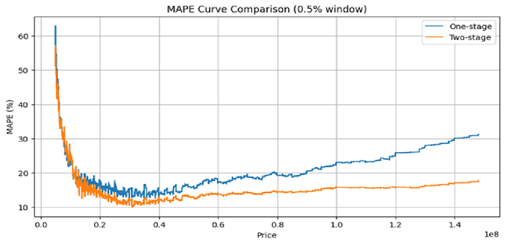

# 物件売買価格予測モデルの構築

## 概要
物件データから不動産の価格を予測するモデルの作成を行った。

---

## 製作期間
- データ確認:1週間
- 特徴量エンジニアリング:3週間
- モデル構築:3週間
- 資料作成:3週間

---

## 背景
現在の不動産の売買価格の決定は人の経験・勘・記憶を頼りに決定されているが、これは将来的には価格予測モデルによって機械的に予測された価格を参考にするという手段も加わると考えられる。
この成果物では
- 機械学習によって不動産売買価格をどの程度予測できるかを示す
- 実運用可能なレベルにまで予測精度を高める

を目的に、不動産の売買価格予測モデルを作成した。

---

## 使用技術
- Python
- pandas
- LightGBM
- scikit-learn
- GoogleColaboratory

など

---

## データ
- SIGNATEのコンペ『第2回 国土交通省 地理空間情報データチャレンジ』(https://user.competition.signate.jp/ja/competition/detail/?competition=2b0105bc0c674f258e39cb2c7711e36f)
- 国土数値情報ダウンロードサイト_地価公示データ(https://nlftp.mlit.go.jp/ksj/gml/datalist/KsjTmplt-L01-2026.html)
- OpenStreetMap(最寄駅からの距離データ取得の為)

---

## 実行方法
データ取得が必要なため、本リポジトリ単体では完全な再現はできない。

---

## 工夫点
One-Stageモデルで作成していたが、低価格帯と高価格帯の評価値が悪かった為、低価格帯と高価格帯の予測に寄り添ったモデルを使用できるTwo-Stageモデルを採用した。

- One-Stageモデル

特徴量 → 価格予測モデル → 予測価格

- Two-Stageモデル

特徴量 → 価格帯確率予測モデル → 価格帯がLow, Mid, Highである確率(p_Low, p_Mid, p_High)

特徴量 → 価格予測モデルLow,Mid,High → 予測価格Low, Mid, High(y_Low, y_Mid, y_High)

p_Low * y_Low + p_Mid * y_Mid + p_High * y_High → 予測価格

---

## 結果

評価方法にはMAPEを使用しました。

|| One-Stage | Two-Stage |
|-----|-----|-----|
|Low(~1500万円)|25.3937|24.9125|
|Mid(1500万円~3000万円)|15.7352|13.4526|
|High(3000万円)|15.5963|12.3667|
|全体|18.5156|16.4793|

全体的にTwo-Stageモデルで結果が良化。ただし低価格帯の評価値は良くない。

## 結論

- 低価格の不動産を予測するために必要なデータが不足している可能性がある(例：老朽化による建て直しが必須、事故物件)
- 中・高価格帯では実運用可能だと考えられる

## 今後の課題

- 低、中、高価格帯の分割点を機械的に決定する(ベイズ最適化)
- 実運用の段階では低価格帯の価格予測を切り捨てることを検討に入れる

## ファイル

- mlit_geospatial_challenge_2.ipynb

GoogleColaboratory環境にて実行することを想定

- 【企業向け】成果物発表会用スライド.pptx

成果物発表会という場にて発表したときのスライド

- requirements.txt

本プロジェクトで使用しているPythonライブラリ一覧。但し、前述の通りGoogleColaboratory環境にて実行することを想定